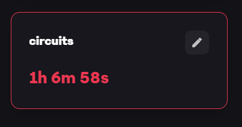

# 🛠️ DEVLOG.md - ExtinguishX Fire Fighting Robot

## 📅 Description of Changes

- Initial project setup and component selection ✅
- Implemented flame detection logic using IR sensors ✅
- Created servo-based aiming mechanism for fire suppression ✅

---

## 🖼️ Images Representing Changes

| Phase | Screenshot |
|-------|------------|
| Initial Planning |  |
| Circuit Designing|  |

---

