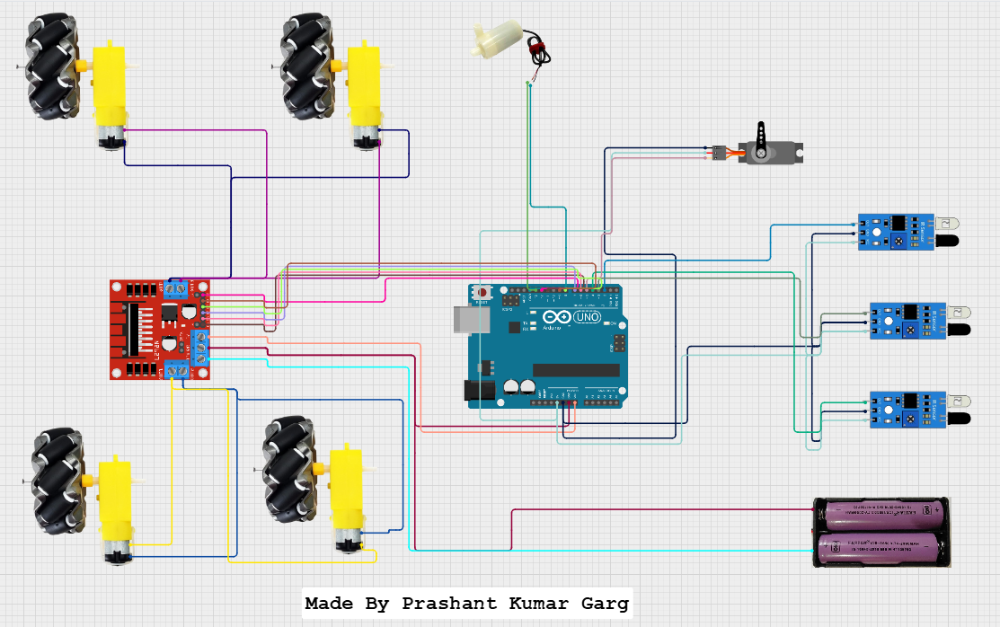

# 🚒🧯👩‍🚒 ExtinguishX - Fire Fighting Robot using Arduino

## 📖 Description

**ExtinguishX** is an autonomous fire-fighting robot developed using Arduino. Designed to detect and extinguish all small fires using IR flame sensors and a servo-mounted pump, the robot can be used in fire-safety demonstrations, educational institutions, and prototype industrial safety automation. The aim is to enhance urban safety and environmental protection by integrating advanced eco-friendly technologies into firefighting vehicles. 

## 💡 Why We Made It

Fire safety is a critical need, and early response can prevent large-scale damage. **ExtinguishX** is built to explore how embedded systems and automation can help improve fire hazard responses. This robot demonstrates a smart, low-cost solution with potential for scalability.

---

## 🧠 Hackatime Project Name

`DECODE`~~ 4 Hours
`CIRCUITS`~~ 1 Hour

---

## 🖼️ Screenshots

| Circuit Design |
|------------|
|  |

---
## 📄 `code.ino` Attached

The full Arduino sketch is included as [`code.ino.txt`](code.ino) in the repository.  

## 📦 Bill of Materials (BOM)

| Component            | Quantity | Description                     |
|----------------------|----------|---------------------------------|
| Arduino Uno          | 1        | Main controller board           |
| IR Flame Sensor      | 3        | For detecting fire              |
| Servo Motor          | 1        | For aiming                      |
| Mini Water Pump      | 1        | Fire suppression mechanism      |
| L298N Motor Driver   | 1        | Controls the DC motors          |
| Chasis+ 4 wheels     | 1        | Locomotion                      |
| Batteries            | 3        | Power source                    |
| Breadboard + wires   | 1        | Testing puposes and connections |

---

## 📁 Files in This Repository

- `README.md` – This documentation
- `DEVLOG.md` – Development log with progress and changes

---
